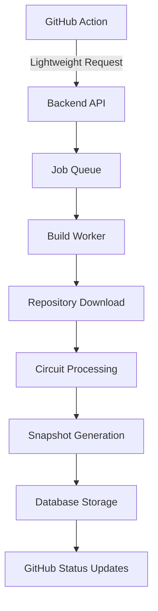

# Migration Guide: Backend Build Processing

This guide explains the migration from GitHub Action-based build processing to a scalable backend-based system that eliminates Vercel's payload size limitations.

## What Changed

### Before (GitHub Action Processing)

- Circuit files were processed in GitHub Actions
- Complete snapshot results (including large SVG files) were sent to the backend
- Vercel's 4.5MB payload limit could be exceeded with complex circuits
- Processing was limited by GitHub Actions runner resources

### After (Backend Processing)

- GitHub Actions only send minimal metadata
- All circuit processing happens on the backend
- Scalable job queue handles builds asynchronously
- No payload size limitations
- Better resource management and error handling

## New Architecture



## API Endpoints

### `/api/build` - Queue New Build

**POST** request with minimal payload:

```typescript
interface SimpleBuildRequest {
  id: string;
  owner: string;
  repo: string;
  ref: string;
  environment: string;
  eventType: string;
  meta: string;
  context: {
    serverUrl: string;
    runId: string;
    sha: string;
    message?: string;
  };
  deploymentId: number;
  checkRunId?: number;
  create_release?: boolean;
  repoArchiveUrl?: string;
}
```

### `/api/build-status` - Check Build Status

**GET** request with job ID:

```typescript
interface BuildStatus {
  jobId: string;
  status: "queued" | "processing" | "completed" | "failed" | "cancelled";
  progress: number;
  message?: string;
  startedAt?: string;
  completedAt?: string;
  errorMessage?: string;
  queuePosition?: number;
}
```

## Database Schema Updates

### New Tables

#### `build_jobs`

- Tracks individual build jobs
- Supports retries and progress monitoring
- Stores job metadata and logs

#### `build_artifacts`

- Stores large files and snapshots
- Supports chunked file storage
- Metadata tracking for generated assets

## GitHub Action Changes

### Updated Workflow

The GitHub Action now:

1. Creates deployment in GitHub
2. Sends lightweight build request to backend
3. Monitors build progress
4. Updates status when complete

### Example Usage

```yaml
name: tscircuit Deploy
on:
  push:
    branches: ["main"]
  pull_request:

jobs:
  tscircuit:
    permissions:
      contents: read
      pull-requests: write
      statuses: write
      checks: write
    runs-on: ubuntu-latest
    steps:
      - uses: actions/checkout@v4
      - uses: tscircuit/deploy-action@v2 # Updated version
        with:
          github-token: ${{ secrets.GITHUB_TOKEN }}
```

## Scalability Features

### Job Queue System

- Priority-based processing (PR builds get higher priority)
- Automatic retries on failure
- Progress tracking and monitoring
- Worker node distribution ready

### Large File Handling

- Streaming file processing
- Chunked uploads/downloads
- Repository archive validation
- Automatic cleanup

### Error Handling

- Graceful fallbacks (archive download → git clone)
- Detailed error logging
- Status propagation to GitHub

## Environment Variables

### Required Updates

```bash
# Add these to your environment
HOSTNAME=your-worker-node-id  # For distributed processing
```

### Existing Variables

All existing environment variables remain the same:

- `DATABASE_URL`
- `GITHUB_BOT_TOKEN`
- `DEPLOY_URL`

## Migration Steps

### 1. Database Migration

Run the database migration to add new tables:

```sql
-- See db/schema.ts for complete schema
CREATE TABLE build_jobs (...);
CREATE TABLE build_artifacts (...);
```

### 2. Update GitHub Action

Update your workflow to use the new action version:

```yaml
- uses: tscircuit/deploy-action@v2
```

### 3. Deploy Backend

Deploy the updated backend with new API endpoints and job processing.

### 4. Monitor

Use the new build status endpoint to monitor job progress.

## Benefits

### Performance

- No payload size limits
- Faster GitHub Action execution
- Parallel processing capability
- Better resource utilization

### Reliability

- Automatic retries
- Better error handling
- Status tracking
- Queue management

### Scalability

- Horizontal scaling ready
- Load balancing support
- Priority queue system
- Resource isolation

## Troubleshooting

### Common Issues

#### Build Stuck in Queue

Check queue status:

```bash
curl -H "Authorization: Bearer $TOKEN" \
  "$DEPLOY_URL/api/build-status?jobId=$JOB_ID"
```

#### Repository Download Fails

The system automatically falls back to git clone if archive download fails.

#### Large Repository Handling

Repositories over 100MB will be automatically rejected. Consider using `.gitignore` to exclude large files.

### Monitoring

- Job queue length via API
- Build progress tracking
- Error logs in database
- GitHub status updates

## Support

For issues with the migration:

1. Check the database logs for job errors
2. Verify environment variables are set
3. Ensure GitHub token has correct permissions
4. Monitor queue status via API

## Future Enhancements

- Distributed worker nodes
- Build caching
- Advanced queue management
- Real-time progress streaming
- Build artifact management
